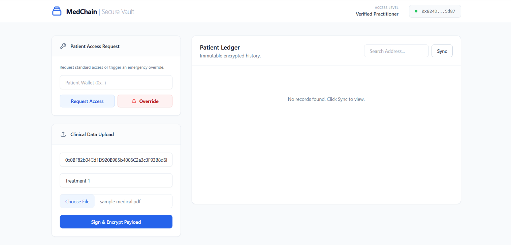

# 🏥 MedChain: Decentralized Medical Vault & AI Assistant

## 📖 Overview
MedChain is a secure, Web3-powered healthcare decentralized application (dApp) designed to give patients total ownership of their medical records. By combining blockchain immutability, IPFS decentralized storage, and a customized AI assistant, this project solves the healthcare industry's issues with data silos and unauthorized access.

## ✨ Key Features
* **Patient-Controlled Access:** Smart contracts dictate exactly which medical practitioners can view records. No centralized hospital database controls the keys.
* **Immutable Audit Trail:** Every access request and document upload is hashed and logged on the Ethereum Sepolia testnet.
* **Decentralized Storage:** Medical PDFs are encrypted and pinned to IPFS via Pinata, ensuring zero single points of failure.

## 🛠️ Tech Stack
* **Frontend:** React.js, TailwindCSS, Ethers.js, Vercel
* **Backend:** Python, FastAPI, Uvicorn, Render
* **Blockchain/Web3:** Solidity, MetaMask, Ethereum (Sepolia Testnet)
* **Storage & AI:** Pinata (IPFS), Fernet Encryption

## 🚀 Live Demo
* **Frontend Application:** [Live App on Vercel](https://medical-blockchain-ai.vercel.app/)
* **Smart Contract Address:** [`0xBF023B919B3c15628D8B31F605c6D2a80aD00725`](https://sepolia.etherscan.io/address/0xBF023B919B3c15628D8B31F605c6D2a80aD00725) (Sepolia Testnet)

## 💻 How It Works (Architecture)
1. Patient uploads a medical PDF.
2. The Python backend encrypts the file and uploads it to IPFS (Pinata).
3. The IPFS hash and access permissions are stored on the Sepolia blockchain via a Smart Contract.
4. When authorized, the backend fetches the file from IPFS, decrypts it.
